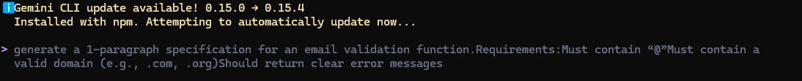
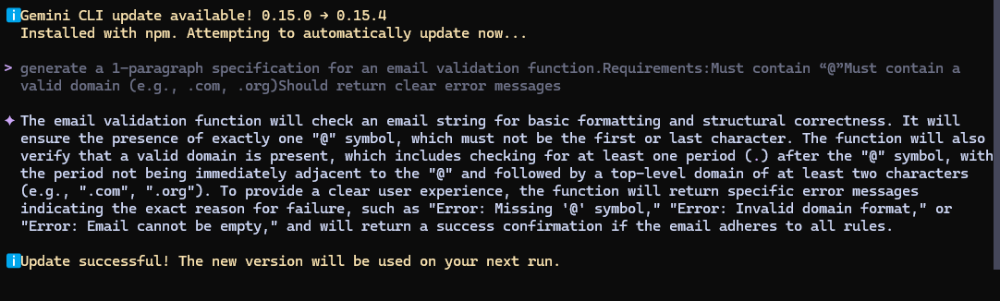

# AI-Driven Development — 30-Day Challenge
## Task - 2

### Q1.  Nine Pillars Understanding ?
- Why is using AI Development Agents (like Gemini CLI) for repetitive setup tasks
better for your growth as a system architect?

- Explain how the Nine Pillars of AIDD help a developer grow into an M-Shaped
Developer

**Ans:**
     **(Growth as a System Architect):** AI Agents used krny ka Fayda ye h k Jab AI Agents (like Gemini CLI) aapke repetitive setup tasks ko handle karte hain , toh hamy time milta hai ke aap system ke design krny aur architecture par focus kar saken —sirf code likhne par nahi. Yeh aapki system architect ke taur par growth ke liye zaroori hai.

     **M-Shaped Developer:** Nine Pillars ek integrated system hai jo ek single developer ko puri team ki tarah kaam karne ki ability deta hai. Jab AI knowledge gaps ko fill karta hai, toh developer 2-4 complementary domains mein deep expertise hasil karta hai, aur is tarah woh M-Shaped Developer banta hai.

### Q2.  Vibe Coding vs Specification-Driven Development?

**Ans** 
**Vibe Coding ke Masail:** Vibe Coding ka matlab hai bina kisi proper planning ya specs ke sirf intuition par bharosa karke code likhna. Iska sabse bada failure yeh hai ke aik week ke baad architecture ko extend karna mushkil ho jata hai. Code complex aur hard-to-maintain ho jata hai.

**Specification-Driven Development** (SDD) mein ham implementation se pehle clear aur executable specifications likhte hain. Iska main maqsad hai coding shuru hone se pehle clear requirements ko finalize karna. Is tarah, shuru se hi architecture well-defined hota hai aur Vibe Coding waale masail nahi aate.

### Q3.  Architecture Thinking?
**Ans**

**Developer ka Role Change:** AIDD mein, architecture-first thinking ki wajah se developer ka role sirf code writer se badal kar system-level thinker ban jata hai (Orchestrator).

**Layers aur Systems mein Sochna:** Developers ko raw code ke bajaye layers aur systems mein sochna chahiye. Maslan, 3 Layer Architecture (Models , IDEs ,Agents) jo intelligence, workspace aur orchestration ko separate karta hai. Yeh mindset AIDD ka sabse bara change hai.

# 📁Part B — Practical Task (Screenshot Required)

**Prompt:**

**Response**

# 📁Part C — Multiple Choice Questions

### 1.  What is the main purpose of Spec-Driven Development?
A. Make coding faster     
B. Clear requirements before coding begins ✅    
C. Remove developers    
D. Avoid documentation   

Ans B 

### 2.  What is the biggest mindset shift in AI-Driven Development?
A. Writing more code manually    
B. Thinking in systems and clear instructions ✅    
C. Memorizing more syntax    
D. Working without any tools     

Ans B

### 3.  Biggest failure of Vibe Coding?
A. AI stops responding         
B. Architecture becomes hard to extend ✅     
C. Code runs slow     
D. Fewer comments written        

Ans B

### 4.  Main advantage of using AI CLI agents (like Gemini CLI)?
A. They replace the developer completely    
B. Handle repetitive tasks so dev focuses on design & problem-solving ✅   
C. Make coding faster but less reliable   
D. Make coding optional   

Ans B

### 5.  What defines an M-Shaped Developer?
A. Knows little about everything   
B. Deep in only one field   
C. Deep skills in multiple related domains ✅  
D. Works without AI tools   

