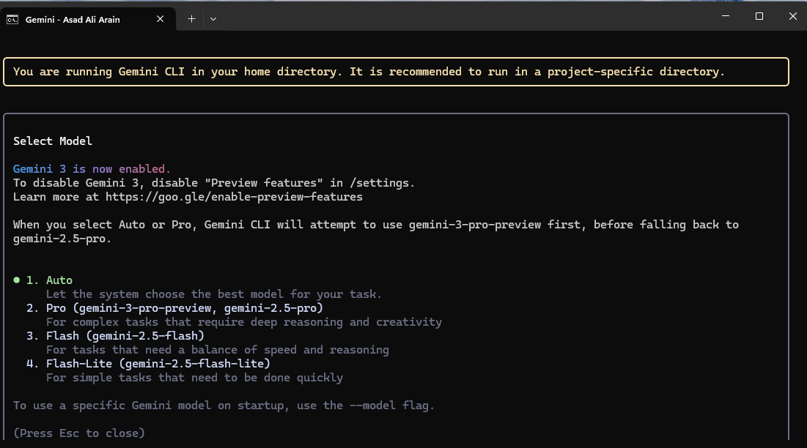

# AI-Driven Development - 30-Day Challenge
## Task 3

# � PART A — Research Questions (Short Answers)

### Q1. What new improvements were introduced in Gemini 3.0?

**ANS**
Gemini 3.0 introduced major advancements focused on intelligence and capability: 

**State Art of the Reasoning**: It can process deep logic, solving much more complex, multi-step problems and understanding subtle details (nuance) in requests.

**Best Multimodal Understanding:** It can seamlessly understand and process all types of information at once—like text, images, videos, audio, and code.

**Huge Memory (Large Context window):** The model can remember and use a massive amount of information at the same time (up to 1 million tokens), allowing it to work with entire codebases or very long documents without forgetting the beginning.

**Better Automation (Agentic Coding):** It's much better at planning and executing complex, multi-step tasks on its own, which makes it a powerful tool for developers and general users.

### Q2. How does Gemini 3.0 improve coding & automation workflows?

**ANS**

Gemini 3.0 provides a major leap in coding and automation through:

**Advanced Agentic Coding:** It can autonomously plan and execute complex, multi-step tasks (like fixing bugs or automating repetitive actions) across the developer's entire workspace.

**Codebase-Level Understanding:** Its large 1 Million Token Context Window allows it to understand entire codebases simultaneously, leading to more accurate code generation, better refactoring, improved debugging, and high-quality documentation.

### Q3. How does Gemini 3.0 improve multimodal understanding?

**ANS**

Gemini 3.0 achieves True Multimodal Understanding by treating all data types—text, images, video, audio, and code—as a single, unified input source, rather than processing them separately. This unified reasoning allows it to synthesize and analyze complex, mixed-media documents (like a research paper with text and diagrams) with high precision, and enables advanced capabilities such as extracting specific actions and patterns from long video segments to generate detailed summaries or training plans.

### Q4. Name any two developer tools introduced with Gemini 3.0?

**ANS**
Two notable developer tools and platforms introduced or significantly upgraded with Gemini 3.0's launch are:

**Google Antigravity:** This is a new agentic development platform. It allows developers to work with autonomous AI agents that can manage and execute complex development workflows (like feature building, bug fixing, and reporting) across their entire workspace.

**Gemini CLI (Command Line Interface):** The CLI was significantly upgraded to fully support Gemini 3.0's agentic coding features. It enables developers to use natural language to generate and execute complex shell commands directly in the terminal.

# PART B — Practical Task (Screenshot Required)

### Asad Ali
### 00044700
### Class Friday 6 to 9 pm
