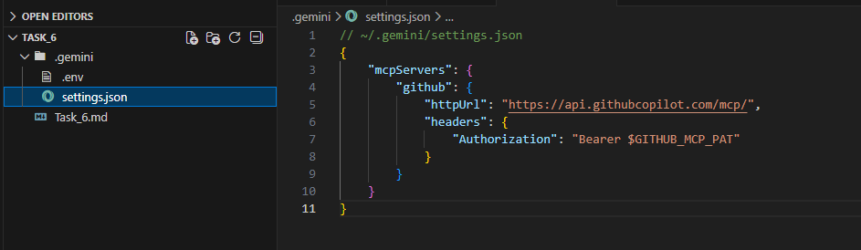
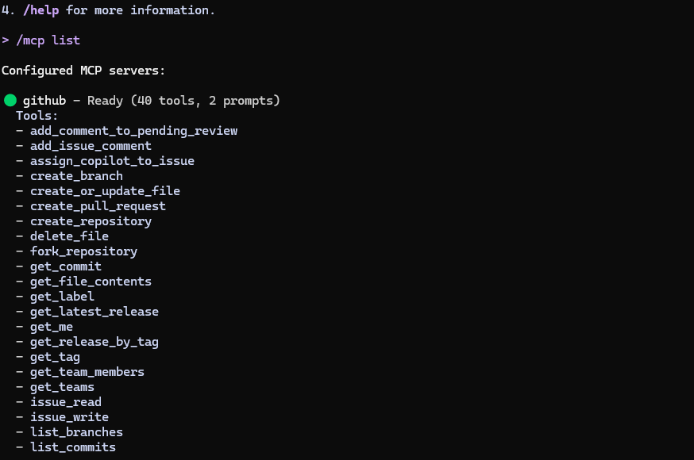

# AI-Driven Development - 30-Day Challenge-Task 6
## Task 6 - GitHub × MCP Integration (Hosted Method)

 **Screen Shots**

 #### .env file (token blurred)

#### settings.json

#### /mcp list result

#### GitHub repo list output

##### Asad Ali
##### 00044700
##### Friday 6 to 9 pm
