# AIDD 30-Day Challenge — Task 8 Submission 

### Task Overview

Build a calculator using SpecKitPlus, and complete all 5 phases:

1. /constitution
2. /specify
3. /plan
4. /tasks
5. /implement

#### 1. Constitution Phase

###### Prompt
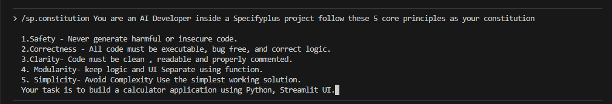

###### Output
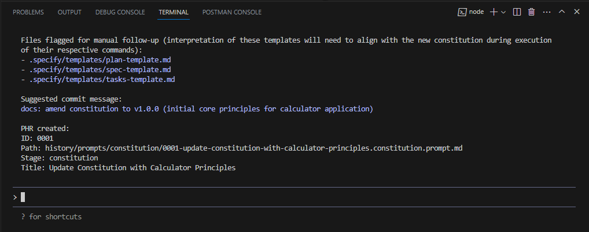

#### 2. Specify Phase

###### Prompt
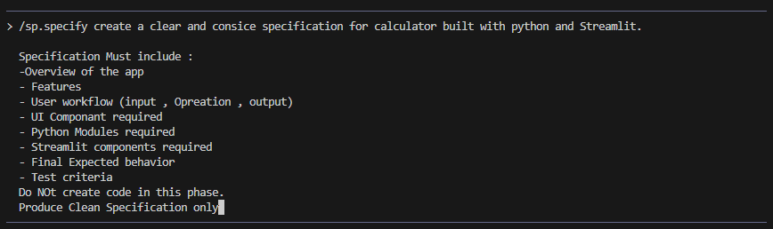

###### Output
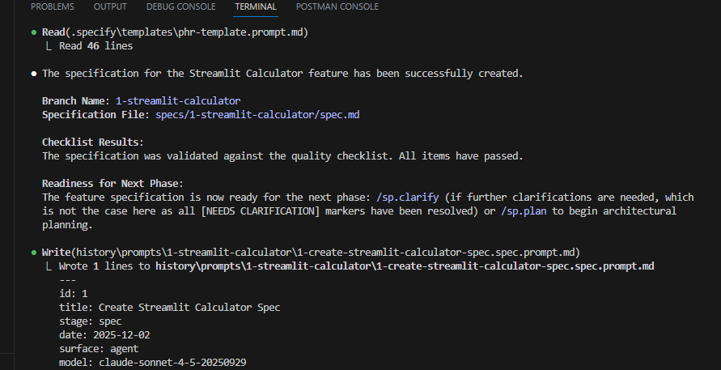

#### 3. Plan Phase

###### Prompt
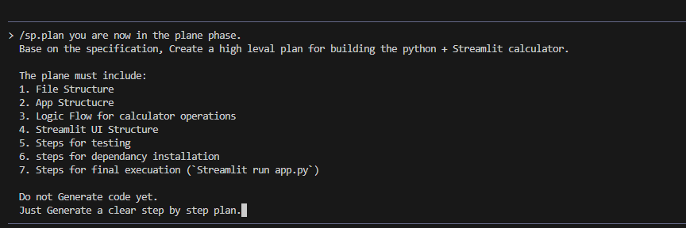

###### Output
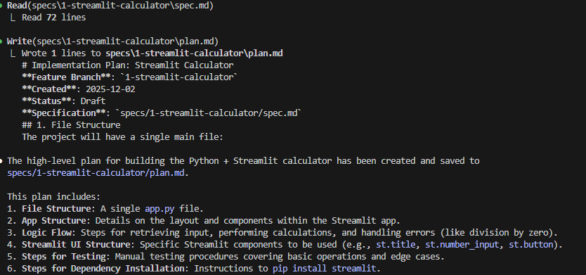

#### 4. Tasks Phase

###### Prompt
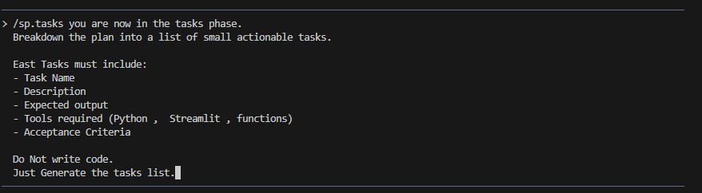

###### Output
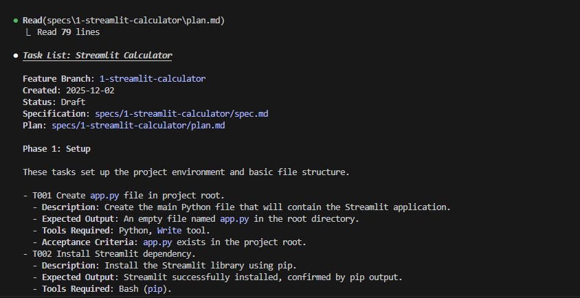

#### 4. Implement Phase

###### Prompt
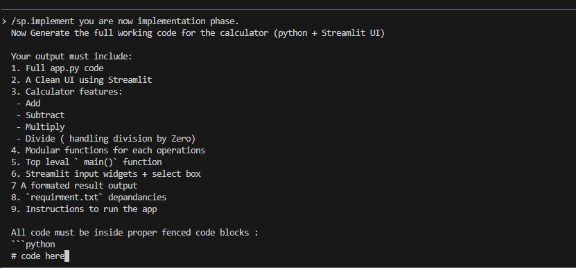

###### Output

### Testing Screenshots

**Addition**
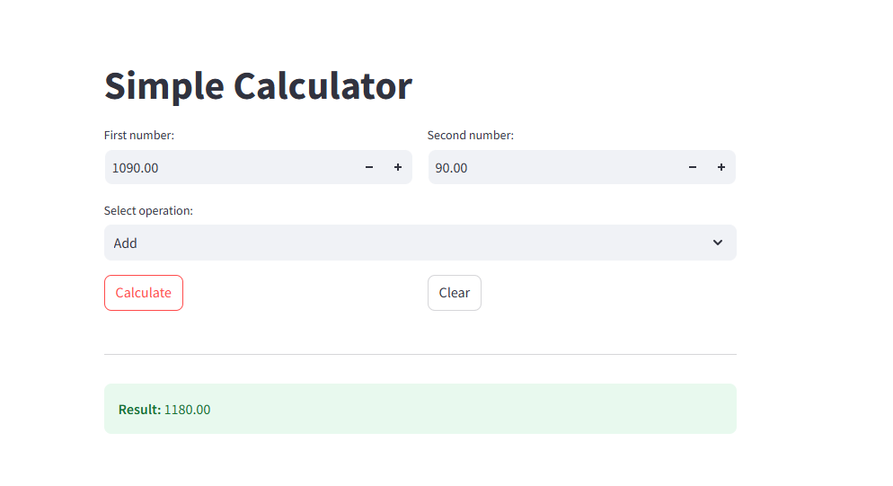

**Subtraction**
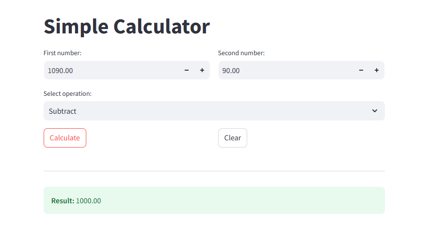

**Multiply**
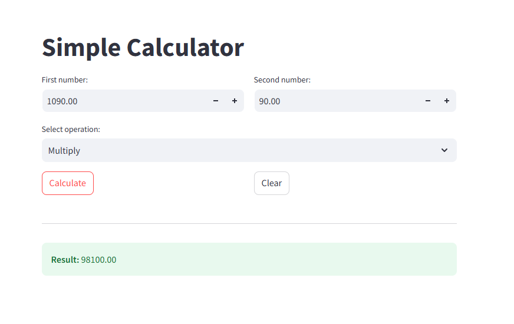

### Asad Ali
### 00044700
### Friday 6 to 9 pm

